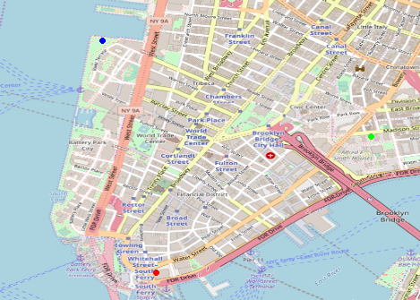
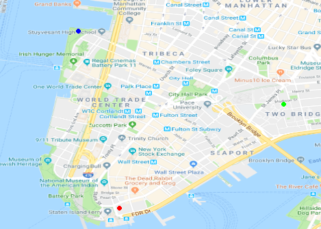

Google has recently changed its API requirements, and users are now required to register with Google.

You can do this at <https://cloud.google.com/maps-platform/>. The API key requires a valid credit card which makes me very uncomfortable. So instead we have a workaround using map tiles:

``` r
library(RgoogleMaps, lib.loc="C:/Users/loecherm/Portable Programme/R-Portable/App/R-Portable/library")
#library(png)

lat = c(40.702147,40.718217,40.711614);
lon = c(-74.012318,-74.015794,-73.998284);
center = c(mean(lat), mean(lon));
zoom <- min(MaxZoom(range(lat), range(lon)));
bb=qbbox(lat,lon)

#OSM
myMap=GetMap(center,zoom=15)
PlotOnStaticMap(myMap,lat=lat,lon=lon,pch=20,col=c('red', 'blue', 'green'),cex=2)
```



``` r
#Google
myMap=GetMap(center,zoom=15,urlBase = "http://mt1.google.com/vt/lyrs=m", tileDir= "~/mapTiles/Google/")
PlotOnStaticMap(myMap,lat=lat,lon=lon,pch=20,col=c('red', 'blue', 'green'),cex=2)
```


